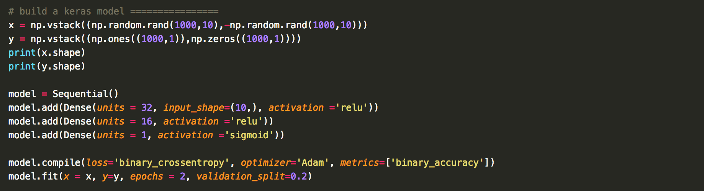
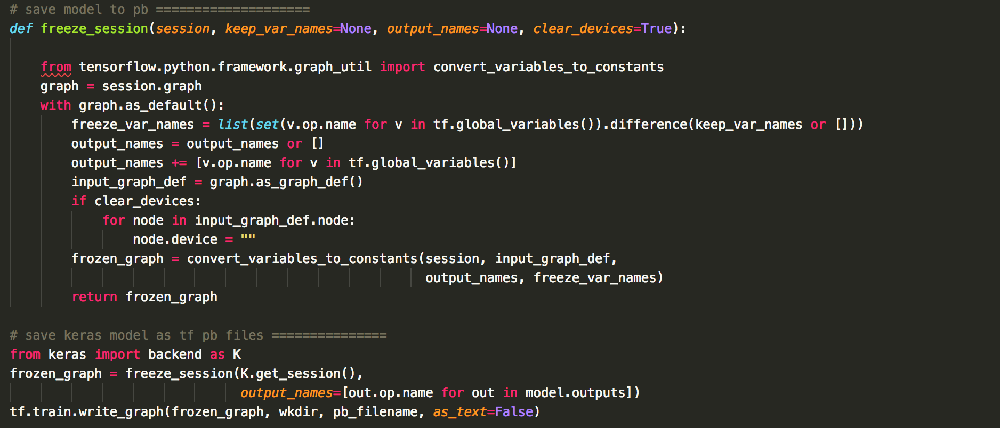
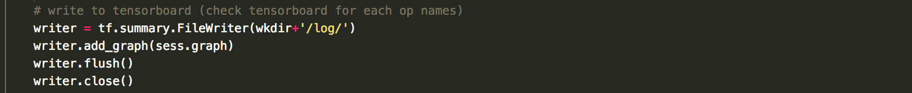
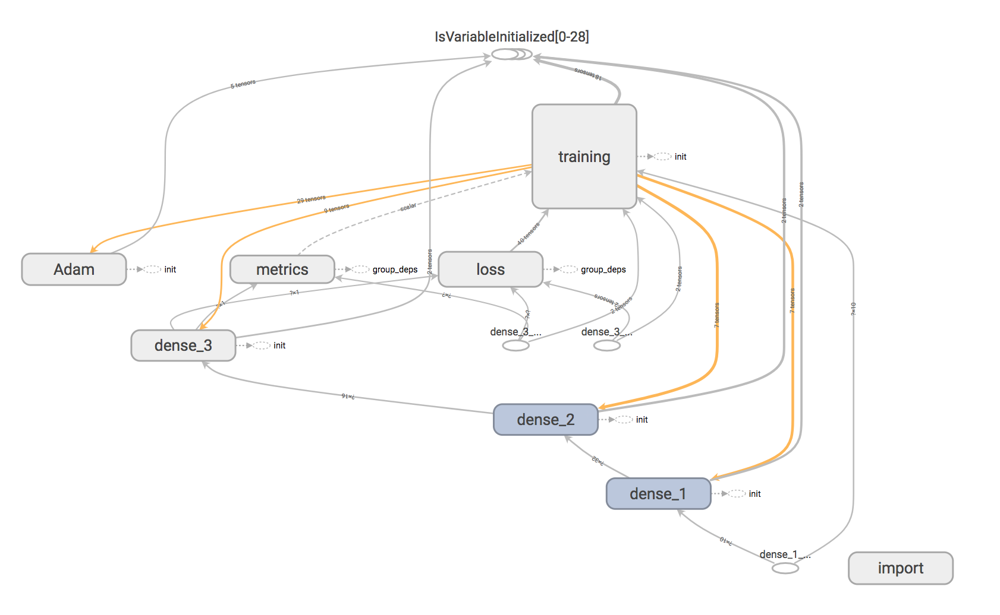
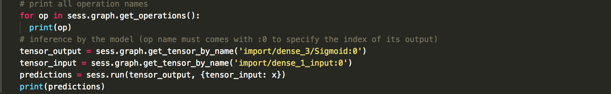
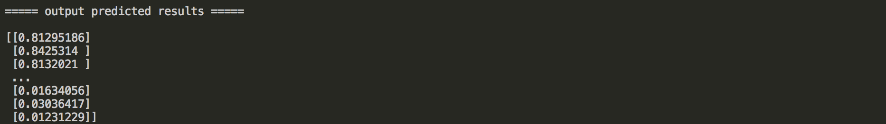

# Convert Your Keras Model to Tensorflow 
Tensorflow is a low-level deep learning package which requires users to deal with many complicated elements to construct a successful model. However, tensorflow is also powerful for production that's why most companies choose tensorflow as their service platform. 

In constrast, Keras provides a user-friendly API to help users quickly build complicated deep learning models but it is not appropriate for making products.

Question:   
Can we build our model in Keras and output it to tensorflow compatiable format (Protocol Buffers, .pb file) for inference? 

In this tutorial, I will show to how to make it possible.   

## Build a keras model 

Okay, let's begin with a simple Keras model. Consider we have 10 random numbers. They are either all positive or all negative. If they are positive/negative, we give it a label 1/0. Then we build a neural network with only two layers and finally output the probability using a sigmoid function. Pretty simple, right? If you run the code, you will find the accuracy goes to 100% with just 1 epoch. 

## Save the Model to Protocol Buffers Format

Tensorflow uses Protocol Buffers format to save the model (.pb file). In gereral, Keras has no way to save its model to .pb format. However, we can make it using another approach. If you check Keras's user manual, there is a function in its backend called [get_session()](https://www.tensorflow.org/api_docs/python/tf/keras/backend/get_session). This function will return a tensorflow session. Therefore, we can play the game as pure tensorflow problem. A simple but useful function to do the trick can be found [here](https://stackoverflow.com/questions/45466020/how-to-export-keras-h5-to-tensorflow-pb) (I keep exactly the same code).

Okay, now you should have successfully generate a .pb file now. The next question is how to let tensorflow load and use the model?

## Load .pb File by Tensorflow

To use a .pb file, you need to use [gfile.FastGFile()](https://www.tensorflow.org/api_docs/python/tf/gfile/FastGFile) method. Remember that our .pb file is binary, so set the mode in 'rb' is necessary. Then create a tf.GraphDef() object and use the method ParseFromString() to import the graph from the .pb file. Finally import this graph using import_graph_def() to the current tensorflow session as shown below. 

okay, now we've succesffuly reconstructed a tensorflow model. Let's try to visuallize the model by tensorboard 

You can find the graph is by default called "import". If you don't like this default, you can add a paramater 'name' when importing the graph, e.g. tf.import_graph_def(graph_def, name='my_model').

## Inference Using the Model

As you can find in the tensorboard, there are many objects in the graph with their unique names such as dense_1, dense_2, etc. You can try to output all of them (including sub-objects) by sess.graph.get_operations(). The names are important because we will use them to call their interface to tensorflow (note: the sigmoid layer is hidden in the dense3 in the tensorboard graph. Just click dense_3 to find it.)

Remember that, all the layer names should end with ":0" (or something else based on your graph). It means you want to fetch the interface to first input/output tensor of the layer. This is required because a layer may sometimes have more than one input/output tensors. 

If everything goes well, you should be able to see the predicted results now. 

A full example can be found [here](./keras_to_tensorflow.py). Enjoy it! 